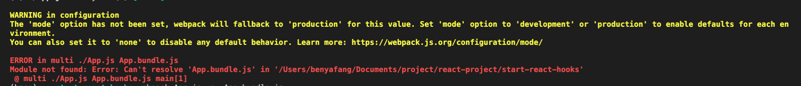
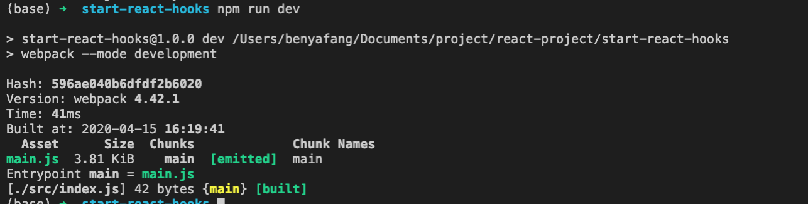

# 从零开始项目

1. 新建项目文件夹
`mkdir start-react-hooks`
2. 进入项目文件夹，并初始化
`cd start-react-hooks`
`npm init`
3. 安装webpack
`npm i webpack webpack-cli --save-dev`
4. 新建文件并写以下代码
`touch App.js`
并输入以下代码
```javascript
function test() {
    console.log('eee')
}
```
5. 命令行执行webpack打包
`webpack App.js App.bundle.js`
报错还有提示信息


报错是因为webpack的版本问题，webpack4.0之前使用上面👆的打包📦命令，最新版本使用`webpack App.js -o App.bundle.js`进行📦，但是并不能解决全部问题，还是有warning

warning是因为webpack4.0之后引入了模式，分为生产模式，开发模式和无三种，需要指定模式

否则的话，生成的打包文件中，并不包含我们写的代码

在`package.json`文件中加入下面👇的代码：
```
  "scripts": {
    "test": "echo \"Error: no test specified\" && exit 1",
    "dev": "webpack --mode development",
    "build": "webpack --mode production"
  },
```

然后使用`npm run dev`命令进行打包📦，结果报错更多了,这是因为使用这个命令，默认对`src/index.js`文件📃进行打包，所以我们需要将之前的文件移动到`src`目录下，并修改文件名为`index.js`，然后在输入`npm run dev`命令就可以正常打包了

可以通过下面的👇图片中看到打包文件的哈希值，打包的时间为41ms，使用的webpack版本为4.42，生成的文件名称为`main.js`，文件大小为3.81KB




# 真正开始一个react工程

1. `npm i react react-dom --save`安装react
2. `npm i webpack-dev-server --save-dev`安装小型的express服务器，支持热加载
3. `npm i --save-dev babel-core`安装babel插件，对js文件进行转换，主要是转换es6到es5
4. 下面的👇的几个babel全家桶的作用还没有完全搞懂
5. `npm i html-webpack-plugin --save-dev`处理html插件

`npm i babel-loader@7 --save-dev`安装加载器，连接到webpack，这里的版本要注意⚠️，不然会报错

`npm install --save-dev babel-preset-react`将react的jsx语法转化成javascript
`npm install eslint-plugin-react-hooks --save-dev`安装hooks规则插件

```
npm install --save babel-polyfill

npm install --save babel-runtime
npm install --save-dev babel-plugin-transform-runtime
npm install --save-dev babel-preset-es2015

npm install --save-dev babel-preset-stage-2
```

5. 修改`package.json`的文件📃,增加程序启动的代码

```
"scripts": {
  "start": "webpack-dev-server --hot --inline --colors --content-base ./build",
  "build": "webpack --progress --colors"
}
```

6. 配置webpack配置文件

暂时简单化，仅配置入口文件，输出文件和js文件的babel转换

```javascript
const path = require('path');
const HtmlWebpackPlugin = require('html-webpack-plugin');
const webpack = require('webpack');

module.exports = {
    mode: 'production',
    entry: {
        'index':['./src/index.js'],
    },
    output: {
        path: path.resolve(__dirname, './build'),
        filename: 'js/[name]-[hash:8].js', // main-8位哈希值，指定生成的文件
    },
    module: {
        rules: [{
            test: /\.js$/,
            exclude: /node_modules/, // 除去node_modules文件的检测
            include: path.resolve(__dirname, './src'), // 仅处理src下的js文件
            use: ['babel-loader'], // 使用babel-loader进行加载
        }]
    },
    resolve: {
        extensions: ['*', '.js', '.jsx', '.css', '.less'], // 识别这几个文件
    }, // 这个配置保证可以识别react的jsx文件
    plugins: [
        new HtmlWebpackPlugin({
            template: './public/index.html', // 处理html模板文件，并放到build文件夹中去
        })
    ]
}
```

# git管理项目
```
git init
git add *
git commit -m "msg"
git remote add origin https://github.com/AlisaBen/start-react-hooks.git
git push -u origin master

```
`git checkout -b dev`切换到dev分支
`git push -u origin dev`推送到远程


# 进入hook主题

## 初识hook

hook是一些可以让我们在函数组件中钩入state和生命周期等特性的函数，只能在function组件中使用

## useState
官网的小例子挺简单的，这里不做过多解释，简而言之，`useState(initValue)`函数的参数是state的初始值，返回的是一个列表，我们可以通过解构赋值，设置状态变量和设置状态变量的函数

[官网教程链接🔗](https://react.docschina.org/docs/hooks-overview.html)
```javascript
function App() {
    const [ count, setCount ] = useState(0);
    return (
        <div>
            <p>you clicked {count} times</p>
            <button onClick={() => setCount(count + 1)}>click me</button>
        </div>
    )
}
```

## useEffect

### 目的
在完成对dom的更改后运行副作用函数
默认情况下会在每次渲染后调用副作用函数

### 事件监听解除


```javascript
import React, { useState, useEffect } from 'react';

export default () => {
    const [ count, setCount ] = useState(0);

    // 相当于componentDidMount和componentDidUpdate函数
    useEffect(() => {
        document.title = `you click ${count} times`
    })

    return (
        <div>
            <p>you clicked {count} times</p>
            <button onClick={() => setCount(count + 1)}>click me</button>
        </div>
    )
}
```

